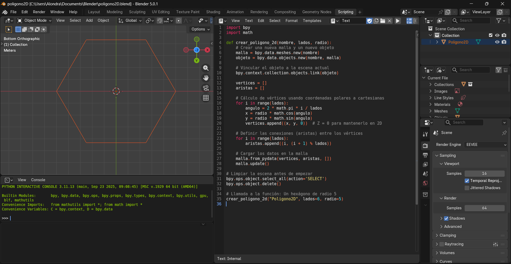

# 1.5 Representación y trazo de líneas y polígonos
La representación y trazo de líneas y polígonos en la graficación por computadora consiste en el proceso mediante el cual se definen y dibujan figuras geométricas a partir de puntos (vértices) en un sistema de coordenadas. 
Las líneas se forman al unir dos puntos mediante algoritmos matemáticos, mientras que los polígonos se construyen conectando múltiples vértices para crear figuras cerradas como triángulos, cuadrados o figuras más complejas. 
Estos elementos son fundamentales en los gráficos digitales, ya que los objetos en 2D y 3D están compuestos principalmente por conjuntos de líneas y polígonos.
Las líneas se representan mediante ecuaciones matemáticas.
Un polígono es una figura formada por varios segmentos de línea.
En gráficos por computadora los polígonos se usan para construir objetos 3D.
Ejemplo:
Un triángulo se define por 3 vértices.
Un cuadrado por 4 vértices.

## Práctica: Polígono

## Práctica: Flor de la Vida

